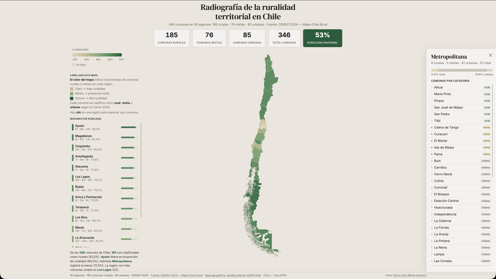

# Radiografía de la Ruralidad Territorial en Chile

Visualización interactiva que clasifica las **346 comunas** de Chile en tres categorías —**rural**, **mixta** y **urbana**— según datos del **CENSO 2024 (Mapa Chile Rural)**, agrupadas por sus 16 regiones administrativas.

## Vista previa



El mapa coroplético muestra cada región coloreada según su porcentaje de ruralidad. Al hacer clic en una región se despliega un panel con el detalle completo de sus comunas.

- **185** comunas rurales
- **76** comunas mixtas
- **85** comunas urbanas

## Estructura del proyecto

```
ruralidad-territorial-chile/
├── index.html                  ← Página principal
├── css/
│   └── style.css               ← Estilos y layout responsivo
├── js/
│   ├── main.js                 ← Carga de datos, mapa D3 y contadores
│   ├── choropleth.js           ← Escala de color secuencial (arena → verde)
│   ├── legend.js               ← Leyenda de gradiente con porcentajes
│   ├── tooltip.js              ← Tooltip enriquecido al hacer hover
│   └── panel.js                ← Panel lateral de detalle por región
├── data/
│   ├── chile_adm1.topojson     ← Geometría ADM1 (16 regiones, geoBoundaries)
│   ├── chile_data.csv          ← Dataset fuente: 261 comunas con tipología
│   ├── chile_data_agg.csv      ← Agregado regional (generado por script)
│   └── chile_comunas.json      ← Detalle de comunas por región (generado)
└── scripts/
    └── generate_comunas_json.py ← Pipeline: genera chile_comunas.json y chile_data_agg.csv
```

## Tecnologías

- **D3.js v7** — Renderizado SVG del mapa y bindeo de datos
- **TopoJSON v3** — Geometría comprimida de regiones
- **CSS Grid + Custom Properties** — Layout y tematización
- **Python 3** — Script de procesamiento de datos

## Datos

El archivo fuente `data/chile_data.csv` contiene las 261 comunas clasificadas como *Rural* o *Mixta* por el Censo 2024. Las comunas restantes (85) se infieren como *Urbanas* a partir del total oficial por región.

El script `scripts/generate_comunas_json.py` procesa este CSV y genera:

- `chile_data_agg.csv` — Conteo agregado por región (rurales, mixtas, totales, porcentajes).
- `chile_comunas.json` — Detalle con listas de comunas por categoría para tooltips y panel.

### Regenerar datos derivados

```bash
python scripts/generate_comunas_json.py
```

## Ejecución local

Servir con cualquier servidor estático:

```bash
npx serve .
# o
python3 -m http.server 8080
```

Abrir `http://localhost:8080` en el navegador.

## Funcionalidades

| Componente | Descripción |
|---|---|
| **Mapa coroplético** | Regiones coloreadas según % de ruralidad (arena → verde bosque) |
| **Contadores animados** | Total de comunas rurales, mixtas, urbanas y total nacional |
| **Tooltip** | Hover muestra breakdown rural/mixta/urbana con preview de comunas |
| **Panel de detalle** | Clic en región despliega lista completa de comunas con categoría |
| **Ranking lateral** | Regiones ordenadas por porcentaje de ruralidad |

## Fuente de datos

- **CENSO 2024 — Mapa Chile Rural** (clasificación de comunas)
- **geoBoundaries** (geometrías administrativas nivel 1)

## Licencia

MIT
